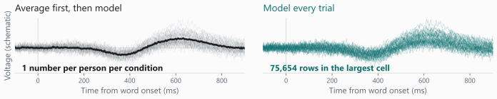
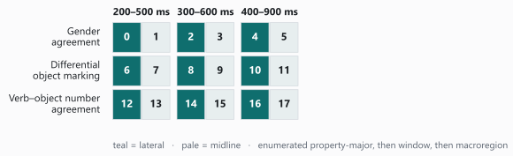
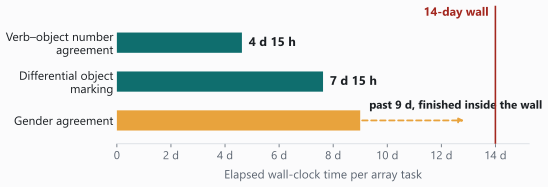
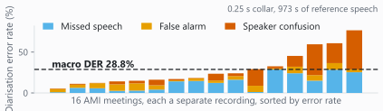
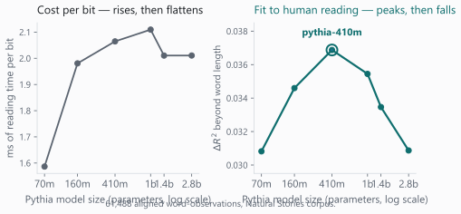

## One power analysis that never finished {data-menu-title="Never finished"}

[Act 1 — Words]{.act}

::: cols-6040
::: {}
[Six months]{.bignum style="font-size:2.0em;"}

[of high-performance computing (HPC) on one question: how many participants does this study
need? The largest samples never finished.]{.bignum-sub}
:::

::: {}
- **Cost grows faster than the sample.** 200 simulated data sets take **18 minutes** at 100
  participants and **43 hours** at 2,000 — twenty times the participants, over a hundred times
  the bill.

- **The top of the grid never came back**, and the paper said so at the time. The priming curves
  stop at 800 participants, so its larger-sample claims are **extrapolation**.
:::
:::

::: {.rule-line}
Compute set a ceiling here. What finished on the cluster set what the paper could claim.
:::

::: {.redbox}
**On Lancaster's facility, during my PhD. Not ARC.** More hardware would not have rescued it:
two of those six months were running, four were waiting.
:::

::: src
Thesis reference in the backup slides. Batch timings read back out of the saved `simr` objects.
:::

::: notes
[~60 s]  (The 25-second opening over the title slide is in the checklist, §7 — learn it; this
pane is blank while you deliver it.)

The hook is intractability. What it cost is beside the point. The analysis outran the method.

Say the shape: cost grows faster than the sample, so the grid is all top end. Double the
participants and you do not double the bill.

Then the honest part: the claims about the largest samples are extrapolations, because those
cells never came back and the paper went out on the curves that did.

Then the turn, clearly, because someone will check: this was Lancaster. And say the split, two
months running against four months waiting, because this room will recognise it.

Then the promise, which is spoken and appears nowhere on the slide: "Three strands follow:
words, brainwaves, speech. Two of the three are CPU-only, and I'll be specific about where the
AI sits." The rest of the talk pays that off.
:::

## What the analysis is, and why it has no closed form {data-menu-title="What the analysis is"}

[Act 1 — Words]{.act}

::: {.cols .airy}
::: {}
- **The question.** Does a word's meaning come from the company it keeps in text, or from how it
  looks and feels?

- **The data.** One observation is one person, one word, one reaction time. Study 1 has
  **345,666** of them.

- **The model.** **20 fixed-effect terms and 9 random-effect terms**, per participant *and* per
  word, because people differ and words differ.
:::

::: {}
- **The simulation loop.** Simulate new responses from the fitted model, refit the whole thing,
  test the coefficient.

- **402 R scripts**, submitted one at a time. The same job today is one line:
  `--array=0-55`.
:::
:::

::: {.rule-line}
No formula gives the power of a model like this. So you refit it: 200 times, per effect, per
sample size. About 80,000 refits in all.
:::

::: src
Sample sizes and model terms from the thesis methods and its `lmerTest` script. Of the 402
scripts, **249 result objects survive**.
:::

::: notes
[~60 s]

Assume no one has met a mixed model. Give the shape of the computation and leave the theory
out: a row per person per word, and a model that refuses to average people or words away.

The sentence to land on: the power question has no closed form, so it has to be simulated. That
is what turns it into an HPC problem.

402 scripts written, 249 objects surviving. Don't overstate it.

The array line is the transferable one for this room. Say it lightly — they have all done it.
:::

## 12,000 core-hours, or 1,150 {data-menu-title="Cheaper by algebra"}

[Act 1 — Words]{.act}

::: cols-6040
::: {}
- **376,054 reaction times.** Redoing that design at full scale costs about **12,000
  core-hours**, or 500 days on a single core.

- **One change does most of it:** score all seven effects from **one** set of simulations.
  Sevenfold, and exact: the same fits, read seven ways.

- **Two more exact steps reach about 1,150.** Power is a success count, so chunks add up, and a
  plainer `simr` object saves another 1.4×.
:::

::: {}
::: {style="text-align:center; margin-top:0.2em;"}
[>2,000]{.midnum style="color:#5b6470;"}<br>
[participants under the archived curves, never reaching 80% power<br>an eight-in-ten chance of
detecting a real effect]{.smallest}

::: {style="font-size:1.3em; color:#0f6e6e; margin:0.2em 0;"}
↓
:::

[46]{.bignum style="font-size:1.7em;"}<br>
[participants at full scale,<br>for the visual-strength effect]{.smallest}
:::

::: {.redbox style="margin-top:0.5em;"}
46 comes from an **analytic screen**. It agreed with `simr` on every effect about whether a
crossing exists, but read about 40% low where checked, so **treat it as a bracket**.
:::
:::
:::

::: {.rule-line}
Algebra alone: 12,000 core-hours became 1,150, and the same reasoning cut the sample the
study needs.
:::

::: src
Measured on the full data set: 199 s per simulate–refit–test at 210 participants, 577 s at 420.
The reanalysis is in preparation.
:::

::: notes
[~75 s] The Act 1 payoff. The compute decision and the scientific decision were the same
decision, so make that the shape of the telling.

Lead with the price: twelve thousand core-hours to redo one power analysis at full scale. Let
that sit for a beat, because it is the number that makes the rest interesting.

Then the tenfold reduction, from algebra and no extra hardware. This is the research-software
half of the job, and this audience will recognise it as their own.

The mechanism is worth one sentence: more trials for each person means each person carries more
information, so the sample the study needs falls.

MUST SAY: "treat 46 as a bracket." A screen that ran 40% low where it could be checked cannot
carry a forty-fold claim without the qualifier.

Say the array is written and costed but not submitted. At this scale the cost is a decision.
:::

## Why EEG became cluster work: we stopped averaging {data-menu-title="We stopped averaging"}

[Act 2 — Brainwaves]{.act}

{fig-align="center"}

::: cols
::: {}
- **The recording.** Electroencephalography (EEG): a voltage at **32 electrodes every 2 ms**
  while someone reads.

- **The conventional move.** Average the surviving trials per condition per person — about 31 of
  the 48 presented — into one clean waveform.

- **What we do instead.** Model **every trial**: 728,352 rows.
:::

::: {}
- **Correlated by-participant and by-item slopes**: one person's effects may move together, and
  one word's. The legacy forbade it, to make the old software converge.

- **32,000 posterior draws per fit.** The model returns a spread of plausible answers, and its
  width is the uncertainty.

- **102 fits, all converged, zero divergent transitions.** Worst R-hat 1.0072, against a gate set
  before fitting: R-hat below 1.01.
:::
:::

::: {.rule-line}
Every core-hour here follows from one choice: 728,352 single-trial rows, thirty times what the
averaged analysis would have carried.
:::

::: src
Numbers from committed result files. Study design: González Alonso et al. (2025),
preregistration osf.io/tjr54; the single-trial Bayesian analyses shown here are in preparation.
96 of the 102 are event-related-potential (ERP) fits. The figure is schematic, not
data: simulated trials with an N400–P600 shape.
:::

::: notes
[~65 s]

Zero ERP knowledge assumed. The figure does the work — point at it.

"The conventional move is to average about thirty trials into one waveform. It's cheap, and it
is the reason this used to run on a laptop. We stopped doing it."

That single methodological choice explains every resource request in Act 2. Say so explicitly;
it is the hinge of the whole act.

Give the convergence line with the gate, because this room will assume big Bayesian models are
flaky. 102 fits, zero divergences, against a threshold set in advance. In your pocket if a Stan
user asks why the slide dropped it: lowest effective sample size 593, against a gate of 400.

Pause after "per fit" on the 32,000. Said quickly, next to "102 fits", it can be misheard as
32,000 fits.

The figure is schematic and the caption says so. Don't imply it is data.
:::

## The array index is the experimental design {data-menu-title="Array = design"}

[Act 2 — Brainwaves]{.act}

::: cols
::: {}
``` bash
#SBATCH --job-name=p1_fit_erp
#SBATCH --partition=long
#SBATCH --ntasks=1
#SBATCH --cpus-per-task=8
#SBATCH --mem-per-cpu=12G
#SBATCH --time=5-00:00:00
#SBATCH --array=0-17

source _shared/hpc/arc_env.sh
export LES_THREADS_PER_CHAIN=2
```

- **8 CPUs is 4 chains × 2 threads each.** Four chains, because convergence is judged by
  comparing them.
:::

::: {}


- **18 tasks is 3 grammatical properties × 3 time windows × 2 scalp macroregions.**
  `--mem-per-cpu` multiplies: 96 GB per task.

- Upstream, extraction asks for **4 × 48 GB = 192 GB**, *"because the legacy merge loads the full
  single-trial EEG for one property at a time."*
:::
:::

::: {.rule-line}
192 GB to prepare the data, 96 GB to model it. Memory is what sizes these jobs.
:::

::: src
`03_fit_erp.slurm`, `SBATCH` block with the log paths elided, and its 18-row `PARAMS` block;
`01_extract_erp.slurm`.
:::

::: notes
[~70 s] Give this one time. Let the script sit on screen and read four lines with the audience —
partition, cpus-per-task, mem-per-cpu, array — not all nine.

The point is the correspondence: every directive traces to a scientific decision. Eight CPUs is
four chains times two threads. Eighteen tasks is three properties by three time windows by two
scalp regions, and the grid on the right is the array index, literally.

While the script is on screen, gloss the walltime: five days is a ceiling I asked for, and the
partition allows thirty. A maximal model on this many trials samples slowly, and the `-O1` pin
slows it further.

Best single line: "the array index is the design grid."

Then the memory line, deliberately, because it inverts what people expect: extraction asks for
twice what fitting does.

Keep this slide even if the talk has to be shortened.
:::

## Two thirds of the array died in the compiler {data-menu-title="Compiler crash"}

[Act 2 — Brainwaves]{.act}

::: cols-6040
::: {}
That array never reached the sampler. Two thirds of its tasks died while building the model:

::: {.redbox style="font-family: Cascadia Mono, monospace; font-size:0.62em;"}
`g++: internal compiler error: Segmentation fault signal terminated program cc1plus`
:::

An internal compiler error: GCC 14.2.0, the compiler inside
`R/4.5.1-gfbf-2025a`, giving up on Stan's `reduce_sum` templates. Measured on a compute node:

| Build | Result |
|---|---|
| threading + `-O3` | [crashes after 19 s]{.warn} |
| threading + `-O2` | [crashes after 4 s]{.warn} |
| threading + `-O1` | builds in 90 s, **chosen** |
| no threading + `-O3` | builds in 82 s |
:::

::: {}
- **Peak memory under 2 GB** against a 96 GB allocation, so nothing here was starved.
  **The fault was in the compiler.**

- **The fix is one line**, appended to `$CMDSTAN/make/local` by every job:

``` bash
CXXFLAGS_OPTIM = -O1
```

- **Dropping threading would have worked too.** But threads add up the likelihood in pieces, and
  a different order of adding changes **the exact posterior draws**. The optimisation level does
  not.

- **Refitted with that line, and no recurrence since.**
:::
:::

::: {.rule-line}
Two fixes cleared the crash. The faster one would have changed the posterior.
:::

::: src
`99_diagnose_ice.slurm`, `99b_test_O2.slurm`, `_shared/hpc/arc_env.sh`.
:::

::: notes
[~80 s] The failure worth telling in full, as a diagnosis — the register this room responds to.

1. Two thirds of the array is dead.
2. Rule out the obvious: under 2 GB peak against 96 GB, so nothing here is starved.
3. Show the four-row reproducer.
4. The fix is one line.
5. Slow down here. The table says the crash needs threading *and* optimisation, so the obvious
   move is to drop threading. I didn't. Dropping threading changes the reduction order in
   `reduce_sum` and therefore the draws. The optimisation level doesn't. Slower beats a
   different posterior.

The `-O1` penalty is unmeasured, so don't be drawn into estimating it.

Say it before anyone asks: the reproducer is five lines and it goes upstream this week. The
offer is on the closing slide.

Keep this slide if the talk has to be shortened.
:::

## The machine learning is CPU-bound, and it is the longest job {data-menu-title="CPU-bound ML"}

[Act 2 — Brainwaves]{.act}

::: cols-4060
::: {}
- **The classifier.** Decode *Grammatical* against *Ungrammatical* from all the electrodes at
  once, at each time point, with a ridge-regularised linear discriminant, scored by area under
  the curve (**AUC**), where 0.5 is chance.

- **The leakage guard.** Leave one whole participant out of every fold, so no one person sits on
  both sides of a split. Chance is measured by permutation: shuffle the labels within participant
  and re-run the entire decoder, **1,000 times**.

- **What that costs.** For one property, 300 time points × 63 participants × 1,001 fits ≈
  **18.9 million** discriminants, each on a 31 × 31 covariance.
:::

::: {}


`--array=0-2`, one task per property, 8 CPUs × 32 GB = **256 GB**. The memory goes on
rebuilding the trial × channel × time tensor. Each individual fit is tiny.

What nine days bought: grammaticality decodable from about **380 ms** after the critical word,
at an AUC of 0.53, above the permutation null.

::: {.rule-line}
The machine learning never touches a GPU: 18.9 million tiny fits, none big enough to fill one.
:::
:::
:::

::: src
`09_run_decoding.R`, `08_decoding.slurm`. 18.9 M is my own arithmetic from sourced parts. Window
and AUC from the committed gender-agreement time course. Verb–object number agreement yields
nothing significant. Grepping the EEG repositories for `gres=gpu`, `cuda` and `torch` returns
only lockfile metadata.
:::

::: notes
[~75 s] The AI/ML flag, and it runs against what the room expects. Let the surprise land.

"This is the machine learning in my EEG work. It is the longest job in the talk — nine days and
more against a fourteen-day wall — and it never touches a GPU."

The reason is the shape: 18.9 million small fits, no single large matrix operation. That
distinction is the useful part for this room.

Mention the leakage guard briefly: leave-one-participant-out, so no participant appears on both
sides of a split. An ML person will respect it.

If anyone counts: 31 electrodes here against 32 on the earlier slide. Both are right — two
mastoids become the reference, and FCz is recovered.

Then the result, which is what the nine days bought: decodable from about 380 ms onwards, at an
AUC of 0.53, against a permutation null we could afford. Say the null result too — one of the
three properties gives nothing. That is what the permutations are for.

Leave the thermal event on the backup slide unless someone asks.
:::

## Some data cannot go to the cloud {data-menu-title="Data that cannot leave"}

[Act 3 — Speech]{.act}

::: pullquote
"Audio recordings and transcriptions … **never leave the institution** under which the recording
was made, are **never transmitted to a remote service**, and are **never used to train any
model**."

[The workflow's own privacy guarantee. The recordings are children's focus groups and research
interviews: special-category data under Article 9 of the UK General Data Protection Regulation
(GDPR), the law's strictest tier.]{.attrib}
:::

::: cols
::: {}
Beyond the law, **opacity about model versions** makes a cloud transcription unreproducible. Nor
is there much accuracy to trade: Landesvatter et al. (2025) found Google Cloud beaten by almost
every open-weight system tested.
:::

::: {}
::: {.redbox}
**Where the documentation stops:** the ARC user guide covers connecting, storage, quotas and
backups. Special-category data is not in it: what may be held, where, or who to ask first.
:::
:::
:::

::: {.rule-line}
The recordings cannot leave the institution, so the compute has to come to them.
:::

::: src
Privacy guarantee: `PYANNOTE_SETUP_GUIDE.md` L11. Documentation gap: the ARC user guide's own
contents, arc-user-guide.readthedocs.io, read September 2026. Landesvatter et al. (2025) in the
backup references.
:::

::: notes
[~70 s]

BRIDGE, say it before the slide settles: "That was the last of the CPU work. There is one place
where a GPU is not optional, and the reason has nothing to do with speed."

Let the pull quote sit on screen and read it aloud, word for word, slowly. It is a promise made
about children's data.

This constrains the *science* itself. That framing is what makes the GPU-on-ARC route the only
one available.

On the Landesvatter finding, add the domain in one sentence: that was short single-speaker
survey audio, so treat it here as suggestive.

Then the documentation gap — it turns a research constraint into something this room can act
on. Say the ask aloud here and let the closing slide collect it: "that conversation is the
service I need most."

Do not claim ARC forbids anything, or quote a policy at them. The point is narrower and safer:
the guide does not cover this, so the route has to be agreed with someone.

If asked where the research audio itself is processed: everything on ARC in this talk is
benchmarking and evaluation on public corpora. Do not go further from the stage.
:::

## Whisper and pyannote as an ARC job array {data-menu-title="Whisper on ARC"}

[Act 3 — Speech]{.act}

::: {.cols .airy}
::: {}
``` bash
#SBATCH --array=0-4
#SBATCH --partition=short
#SBATCH --clusters=htc
#SBATCH --cpus-per-task=4
#SBATCH --mem=32G
#SBATCH --gres=gpu:1
```

- `openai/whisper-large-v3` on GPU, with `pyannote/speaker-diarization-3.1` labelling who spoke
  when on the same device. One array task per corpus, resubmitted per model: **3 models ×
  5 corpora × 16 text-cleanup conditions = 240 scored combinations**.
:::

::: {}
Large-v3: **6.2% word error rate on read speech, 32% on meeting audio**, roughly one word in
three to correct. Same model. The audio decides.

``` bash
JID=$(sbatch --parsable hpc/submit_sweep.sh)
sbatch --dependency=afterok:${JID} hpc/aggregate_sweep.sh
```

Aggregation runs only if decoding succeeded: no GPU, 8 GB, half an hour.

::: {.rule-line}
The GPU decodes each corpus once, so a seventeenth condition costs no GPU time. Don't spend a
GPU allocation on string comparison.
:::
:::
:::

::: src
`submit_sweep.sh` and `aggregate_sweep.sh`, log paths elided. Word error rate from the committed
`sweep_aggregate.csv`, macro-averaged over LibriSpeech test-clean and the AMI Meeting Corpus
individual-headset-microphone split (Carletta et al., 2006), CC BY 4.0.
:::

::: notes
[~70 s] The primary GPU slide, and the second real artefact.

Read the header. Note `--clusters=htc` and say why: on ARC, GPUs live only on HTC.

Then the two accuracy numbers, because they are the first the audience has heard: six per cent
on read speech, thirty-two on meetings. The model is fine. The audio is the problem.

The economical part: sixteen text-cleanup conditions scored off one decoding pass, so all
sixteen cost one pass of the GPU between them.

Then the job-chaining pair, which is the one thing here they can take away today. Punchline: "don't
spend a GPU allocation on string comparison."

If asked: production batch transcription runs CPU-only, deliberately, with the reason recorded
in the script — *"GPU disabled - using CPU-only PyTorch for stability"*. The GPU is in
benchmarking and fine-tuning.
:::

## Two checks I could afford to run {data-menu-title="Two cheap checks"}

[Act 3 — Speech]{.act}

::: cols-6040
::: {}
[1 — A fix that halved the end-boundary error]{.colhead}

Over 499 AMI meeting utterances, Whisper's starts are near frame-accurate. Its **ends are
not**.
**Silero**, a 1 MB voice-activity detector, re-cuts each end at the last voiced frame.


| Boundary error | before | after |
|---|---|---|
| **End, mean absolute** | 127.1 ms | [**63.9 ms**]{.tealx} |
| **End, root-mean-square** | 460.5 ms | [**253.6 ms**]{.tealx} |
| Start, mean absolute | 8.7 ms | [8.7 ms]{.muted} |
| Start, root-mean-square | 70.9 ms | [70.9 ms]{.muted} |

Root-mean-square error punishes outliers: 460 ms is outside the 0.25 s collar the field scores
against, 254 ms inside. The start rows are **bit-identical**.
:::

::: {}
[2 — A change that made diarisation worse]{.colhead}



Lower pyannote's clustering threshold to 0.60 and diarisation gets [**worse**]{.warn}:
**28.8% → 31.9%** of speech time mislabelled. Clustering only renames speakers, so missed speech
and false alarm stay **bit-identical**.

::: {.redbox}
A 16-meeting subset, and that average hides a spread from **5.6% to 76.7%**.
:::
:::
:::

::: {.rule-line}
Cheap re-runs change what you are willing to verify, and what you are willing to publish.
:::

::: src
`timestamp_summary.json` versus `evaluation_vad_refine/`;
`der_summary.json` versus `evaluation_clustering_0.60/`. Both runs: one short GPU job on an
H100 node.
:::

::: notes
[~80 s] The strongest research-computing argument in the talk. Take them in order and keep them
short; the shared line at the end is what matters.

Check one. The reasoning matters more than the halving: Whisper's *starts* were already good,
so a fix that also moved the starts would be a fix doing something else. They didn't move —
bit-identical, to the digit. And the collar anchor: 460 ms is outside the tolerance the field
scores against, 254 ms is inside it.

Check two. A negative result. I lowered pyannote's clustering threshold, it made diarisation
worse, and I published that. Then the mechanistic control, which is the part that makes it
science: only speaker confusion moved.

Then the caveats, unprompted: the mini-meeting baseline, and the 5.6-to-76.7 spread behind that
average.

Land the shared line slowly, and add the half that is not on the slide: "Neither of these is a
check I would have run if re-running were expensive."
:::

## Where the GPU is, and where it is not {data-menu-title="AI/GPU audit"}

| | What | Where |
|---|---|---|
| [**GPU, inference**]{.tealx} | Whisper large-v3, distil-large-v3 and medium; pyannote 3.1 diarisation; Silero VAD; six Pythia language models, 70m–2.8b parameters | ARC `htc` |
| [**GPU, training**]{.tealx} | Fine-tuning `pyannote/segmentation-3.0`. **The only model I train**, because far-field diarisation runs near 57% error, the sound of a real focus group. | ARC `htc` |
| **CPU, machine learning** | Leave-one-participant-out ridge linear-discriminant decoding; projection-predictive variable selection; brms and Stan throughout | ARC |
| **No GPU, on purpose** | *"Do not add `--gres=gpu` to any SLURM script. Stan/CmdStan does not benefit from GPU for the ordinal mixed models used here."* **Continuous integration fails the build if a GPU directive appears.** | ARC |

An unconstrained GPU job died in **14 seconds** on a Skylake node: *"your machine doesn't
support AVX512_CLX"*. The fix was a **CPU**-generation constraint on a **GPU** job.

::: {.rule-line style="margin-top:0.4em;"}
The GPUs here run other people's models as measuring instruments.
:::

::: src
`submit_benchmark_wer_gpu.sh`, `submit_finetune_pyannote.sh`, `09_run_decoding.R`,
`08_projpred_selection.R`, the CLAPS ARC workflow doc, and `fit-surprisal-extended.slurm`.
:::

::: notes
[~40 s] Discharge the AI and GPU promise completely, in one table, so nobody leaves with a wrong
impression.

Walk the four rows quickly. If anyone asks what the fine-tuning achieved, the honest answer is
in the backup questions: not yet run to a result.

Give row four a beat: a project with an explicit no-GPU policy, enforced by CI, with a stated
technical reason.

Then the AVX512 story. The maths library aborts at import on the wrong core generation, so the
fix for a GPU job is a CPU constraint.

Close on the framing line. I am using other people's models as measuring instruments.
:::

## What the cluster made possible {data-menu-title="What became possible"}

::: cols-6040
::: {}
**Words.** Six Pythia models scored in **one GPU job**: how unexpected each word was, against how
long people took to read it. **Inverse scaling**: past a certain size, a better language model
predicts *people* worse.

**Brainwaves.** Chance established by permutation: 1,000 re-runs of the decoder for each
property, including the one that came back null.

**Speech.** A word error rate that depends on what you agree to throw away. The same transcripts
score 6.2% on read speech and 2.3% under the canonical normaliser, which discards the
punctuation, casing and fillers my questions need.

**Design.** A sample-size requirement bracketed near 46 where the old one said more than
2,000, and **before** anyone is recruited.
:::

::: {}

:::
:::

::: {.rule-line style="margin-top:0.2em;"}
In all four, the cluster changed which question I could ask. Not faster — different.
:::

::: src
`fit-surprisal-extended.slurm` and the chapter-19 freeze output. Paired bootstrap over words:
pythia-410m beats pythia-2.8b in 99% of 500 resamples, 95% confidence interval on ΔR²
[0.0010, 0.0121]. Full references in the backup slides.
:::

::: notes
[~65 s] The close the brief asks for: what became newly *possible*.

Open with the four bottlenecks, none of which is on the slide. The audience has met every one
already. Memory was the 192 GB extraction, the compiler was the crash, the walltime was the
decoding wall, and the filesystem was the weights staged out to nodes with no egress.

Then the Pythia result, where words, brainwaves and HPC finally meet in one frame. Be careful
and accurate: the turnover is a few thousandths of R-squared. It is modest and it is real.
Don't oversell it, and don't claim the question needs a cluster. It doesn't. But scoring six
models over a whole corpus is not a job anyone would do by hand — and all six run at one
precision, fp32, so the scores are comparable across models.

The normaliser line is the one an evaluation-minded audience will remember: the benchmark number
you publish is a function of what you agree to throw away.

Land on "not faster — different."
:::

## What would help most {data-menu-title="Asks and offers"}

::: {.cols .airy}
::: {}
[What I'd ask for]{.colhead}

- **A documented route for special-category data.** The user guide covers storage and backups.
  What may be held, and who to agree it with, is left open. That conversation decides what
  social-science work I can bring here.

- **The array-size cap, written down.** `htc` capped one of my arrays at 1,000 tasks: 4,800
  submitted, 1,000 ran, and a preregistration carries 37 to 48 converged simulations a cell
  where the design called for 300. The scheduling page documents partitions and walltimes, and
  stops there.
:::

::: {}
[What I can offer]{.colhead}

- **The compiler bug, upstream.** A five-line reproducer and a one-line fix for the internal
  compiler error in `R/4.5.1-gfbf-2025a`, sent this week.

- **A case study.** My field's standard toolkits — EEGLAB, FieldTrip, MNE, SPM, Praat — are none
  of them in the module list. I would write up what a social-science user installs.
:::
:::

::: {.rule-line}
Nothing here is a request for more compute. It is one conversation, one limit written down,
and a bug report.
:::

::: src
**Acknowledgement, as ARC asks:** *"The authors would like to acknowledge the use of the
University of Oxford Advanced Research Computing (ARC) facility in carrying out this work.
https://doi.org/10.5281/zenodo.22558"*<br>
pablo.bernabeu@education.ox.ac.uk · ORCID 0000-0003-1083-2460 · github.com/pablobernabeu ·
Transcription workflow: doi.org/10.5281/zenodo.17624830
:::

{.crest}

::: notes
[~85 s] End on an exchange. Asks on the left, offers on the right, equal weight,
so it does not read as a complaint list.

The sensitive-data ask is the real one, and it is the one this room can act on. Say plainly that
it decides whether a whole category of social-science work can use ARC at all.

The array cap is deliberately specific, so a research software engineer can write it up this
month. If asked how 300 became 37 to 48: a thousand tasks of 4,800 is 62 or 63 attempted a cell,
about 30% died at the eight-hour wall, and the convergence gate took a few more.

If containers come up, say what is on the record and no more: one of your own config files says
the runtime is absent, and one of your own repositories builds an image on `htc`. You have not
reconciled those, so do not assert either from the stage.

Then the offers, which are the half of the slide that keeps it from reading as a complaint
list. The bug report and the container note are both things this room can use on Monday.

CLOSING SENTENCE, say it and stop:
"Two signals, one axis and a cluster that let me keep every trial of both. The sensitive-data
conversation is the one I'd most like to have — and I'm happy to take questions."

If asked how much compute I have used: it varies by project, and the total is never the
interesting number. Which resource was binding is.
:::

# Backup slides {.appendix data-menu-title="— Backup —"}

Material for questions.

## Two operational lessons, both mine {.appendix data-menu-title="Backup: operations"}

::: {.cols .airy}
::: {}
- A node was drained for a **datacentre thermal event** and Slurm requeued the task correctly.
  Eleven of thirteen blocks were complete, and nothing was on disk. Another run was lost to a
  `NODE_FAIL`. Between them, more than a fortnight, all of it recoverable at the cost of one
  design decision.

- **The fix:** checkpoint every 50 permutations, caching `.Random.seed` alongside, so a resumed
  run is bit-identical to an uninterrupted one. In the code's own words, *"an artefact must not
  depend on how often the scheduler killed the job."*
:::

::: {}
- **Never `scp` a script that a running job is executing.** `Rscript` parses one expression at a
  time, holding a byte offset into the file, so overwriting shifts the content underneath it. An
  array element five days into its run wrote every artefact, then died on a parse error, breaking
  the `afterok` dependency downstream.

- **Hence a watcher job** — 20 minutes, 4 GB — submitted with **`--dependency=afterany`**,
  precisely because that array is expected to exit non-zero on complete success.

- **A chaining lesson.** A three-minute cross-property analysis, chained `afterok` on the
  whole decoding array, sat queued behind a fortnight of permutation runs.
:::
:::

::: notes
Useful in questions. Don't volunteer it: it costs 40 s the talk does not have.
:::

## Anticipated questions {.appendix data-menu-title="Backup: Q&A"}

::: cols
::: {.smaller}
**How much compute have you used?** It varies enormously by project, and the total is never the
interesting number. What binds is memory, a toolchain or a wall-clock limit, essentially never
raw throughput.

**Why not run Stan on a GPU?** For these models it does not help. The bottleneck is posterior
geometry and the sheer *number* of fits. A GPU accelerates dense linear algebra, which is a
small part of the work here. The project's own rule says so, and CI enforces it.

**Would a GPU help the LDA decoding?** Possibly, but the cost is 18.9 million *small* fits and
the permutation null is embarrassingly parallel across time points and folds. An array of CPU
tasks fits the shape better. I have not benchmarked the alternative, so I will not claim it.

**Isn't 1,000 permutations overkill?** No. At 200 the *p*-floor is 1/(B+1) = .00498, which
exceeds α/m for the confirmatory cluster family. The code refuses its own earlier artefacts on
exactly that ground.

**Do you let an agent submit jobs?** It polls `squeue` and `sacct` read-only and proposes the
next stage; submission is mine. Standard QoS only, never the priority flag, admin holds never
released, nothing cancelled without confirming supersession.
:::

::: {.smaller}
**What is the word error rate on your own interviews?** Unknown, and I will not guess. A ground
truth means a second human transcript, and two transcribers disagree with each other. The
benchmark corpora tell me how much correcting to expect; they do not tell me how accurate my
transcripts are. That is why the workflow outputs a draft a researcher corrects.

**Did the pyannote fine-tuning improve anything?** Not yet. The job is written and resourced
against a far-field baseline near 57% diarisation error, and it has not been run to a result I
can report.

**Why `-O1`, and why keep threading?** Because dropping threading changes `reduce_sum`'s
reduction order and therefore the exact posterior draws. The optimisation level does not.

**Have you reported the compiler bug upstream?** The reproducer is five lines and it goes this
week — a pointer to the right route would help.

**Is this not BMRC's problem?** BMRC is a separate service. Education is in Social Sciences, so
ARC is the service I am entitled to and the one I use.

**Could the 14-day wall be shorter?** Fourteen days is what I asked for; the `long` partition
allows thirty. For the permutation null I would not go lower, but a fortnight backfills badly,
so I would sooner checkpoint and request less.
:::
:::

## References {.appendix data-menu-title="Backup: References"}

::: cols
::: {.smallest .refs}
Bernabeu, P. (2025). *Secure and scalable speech transcription for local and HPC* (Version 1.0.0)
[Computer software]. Zenodo. https://doi.org/10.5281/zenodo.17624830

Bernabeu, P. (2022). *Language and sensorimotor simulation in conceptual processing: Multilevel
analysis and statistical power* [Doctoral thesis, Lancaster University]. Lancaster University
research directory. https://doi.org/10.17635/lancaster/thesis/1795

Biderman, S., Schoelkopf, H., Anthony, Q., Bradley, H., O'Brien, K., Hallahan, E., Khan, M. A.,
Purohit, S., Prashanth, U. S., Raff, E., Skowron, A., Sutawika, L., & van der Wal, O. (2023).
Pythia: A suite for analyzing large language models across training and scaling. *Proceedings of
Machine Learning Research, 202*, 2397–2430. https://proceedings.mlr.press/v202/biderman23a.html

Carletta, J., Ashby, S., Bourban, S., Flynn, M., Guillemot, M., Hain, T., Kadlec, J., Karaiskos,
V., Kraaij, W., Kronenthal, M., Lathoud, G., Lincoln, M., Lisowska, A., McCowan, I., Post, W.,
Reidsma, D., & Wellner, P. (2006). The AMI Meeting Corpus: A pre-announcement. In S. Renals & S.
Bengio (Eds.), *Machine learning for multimodal interaction* (pp. 28–39). Springer.
https://doi.org/10.1007/11677482_3
:::

::: {.smallest .refs}
Futrell, R., Gibson, E., Tily, H. J., Blank, I., Vishnevetsky, A., Piantadosi, S. T., &
Fedorenko, E. (2021). The Natural Stories corpus: A reading-time corpus of English texts
containing rare syntactic constructions. *Language Resources and Evaluation, 55*(1), 63–77.
https://doi.org/10.1007/s10579-020-09503-7

González Alonso, J., Bernabeu, P., Silva, G., DeLuca, V., Poch, C., Ivanova, I., & Rothman, J.
(2025). Starting from the very beginning: Unraveling third language (L3) development with
longitudinal data from artificial language learning and EEG. *International Journal of
Multilingualism, 22*(1), 119–142. https://doi.org/10.1080/14790718.2024.2415993

Landesvatter, C., Behnert, J., & Bauer, P. C. (2025). Comparing speech-to-text algorithms for
transcribing voice data from surveys. *Public Opinion Quarterly, 89*(4), 1154–1166.
https://doi.org/10.1093/poq/nfaf056

Radford, A., Kim, J. W., Xu, T., Brockman, G., McLeavey, C., & Sutskever, I. (2023). Robust
speech recognition via large-scale weak supervision. *Proceedings of Machine Learning Research,
202*, 28492–28518. https://proceedings.mlr.press/v202/radford23a.html

Richards, A. (2015). *University of Oxford Advanced Research Computing* [Technical note]. Zenodo.
https://doi.org/10.5281/zenodo.22558
:::
:::

::: src
Software and model versions are given on the slides that use them. Full list, with links, in the
repository.
:::
